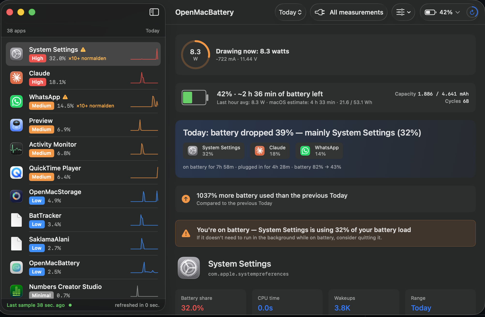

# OpenMacBattery

**Open source per-app battery monitor for macOS.** Find out which app is draining your MacBook's battery — *looking back, not just right now*.

[](LICENSE)
[](#requirements)
[](#requirements)
[](Sources/OpenMacBatteryApp/Resources)

> Activity Monitor only knows the present moment. macOS's built-in Battery panel only shows the last 12 hours.
> **OpenMacBattery remembers the past 30 days, per app.**



## What it does

Asks the question: **"My battery dropped 40% between 02:00 and 08:00 — which app was responsible?"**

- Samples every running process every 60 seconds via `proc_pid_rusage` (no sudo needed).
- Stores per-app energy/CPU/wakeup deltas in a local SQLite database.
- Shows live system wattage, per-app share, battery life estimate, sleep periods.
- Right-click any app → quit / force-quit / show in Activity Monitor.
- Compares current period vs previous (anomaly detection).
- Available in 8 languages.

## About this project

I'm a MacBook user — not a professional software developer. I built OpenMacBattery because I wanted to answer a simple question macOS refuses to answer: *"My battery dropped 40% overnight — which app was responsible?"* Activity Monitor only knows the present moment, the built-in Battery panel only shows the last 12 hours, and the polished paid alternatives didn't quite fit what I needed.

So I built it for myself, **substantially with the help of AI coding assistants** — I want to be upfront about that. Every product decision, UX choice, and honest caveat in this README came from me; the AI did the heavy lifting on Swift, SwiftUI, IOKit, and SQLite. The result is real, working software that I run on my own MacBook every day.

I'm releasing it because once it worked for me, there was no reason to keep it private. If you're a Mac user who wants to know what's draining your battery — please use it. If you're a Swift / macOS developer who spots code that could be written better, or a native speaker who can improve one of the non-English translations, **please open an issue or pull request**. I'd much rather hear *"here's a better way to do X"* than discover it later in a crash report. That's the whole point of putting this out in public.

— Murat Dugan

## Privacy

- **Zero network code.** No telemetry, no analytics, no cloud sync. Verify yourself: `grep -r "URLSession\|http\|socket" Sources/`.
- Database lives at `~/Library/Application Support/OpenMacBattery/data.db` with 600 permissions (only you can read).
- Logs at `~/Library/Logs/openmacbattery.log` also 600.

## Requirements

- macOS 14+ (Sonoma / Sequoia / later)
- Apple Silicon (M-series) — Intel Macs work but `ri_billed_energy` may behave differently
- For building from source: Xcode Command Line Tools (`xcode-select --install`)

## Download

**[⬇ Latest release (DMG)](https://github.com/MuratDugan/openmacbattery/releases/latest)**

1. Download `OpenMacBattery-x.y.dmg`
2. Open it, drag **OpenMacBattery** onto **Applications**
3. Launch from Spotlight or Launchpad
4. On first launch macOS may say *"unidentified developer"* — right-click the app → **Open** → **Open**. macOS remembers this.
5. Click **Enable background tracking** in the welcome sheet

Done. Data starts accumulating within 1–2 minutes.

## Build from source

If you'd rather compile yourself:

```bash
git clone https://github.com/MuratDugan/openmacbattery.git
cd openmacbattery
./scripts/make-app.sh --install   # builds and installs to /Applications
# or
./scripts/make-dmg.sh              # produces build/OpenMacBattery-x.y.dmg
```

Requires Xcode Command Line Tools (`xcode-select --install`).

## How it works

Three pieces, one binary:

1. **Sampler daemon** (`openmacbattery daemon run`) — runs in background via user LaunchAgent. Every 60 seconds, calls `proc_pid_rusage(RUSAGE_INFO_V6)` for every accessible process and writes deltas to SQLite. Self-throttles to 120s if a sample tick exceeds 500 ms (with hysteresis to recover when fast).
2. **GUI** (SwiftUI) — reads the same SQLite database read-only. Live wattage from `AppleSmartBattery` IORegistry entry. App icons from `NSWorkspace`.
3. **CLI query commands** — `openmacbattery top`, `app`, `timeline`, `export`, `stats`, `prune`, `calibrate`.

The SQLite database uses WAL mode + `auto_vacuum=INCREMENTAL`. Hourly aggregates are rolled up automatically; raw samples older than 7 days and aggregates older than 180 days are pruned daily at ~03:00.

## Honest caveats

- **`ri_billed_energy` is not documented to be joules.** It's an Apple internal counter; we expose the raw value and apply an empirical calibration if you run `openmacbattery calibrate --duration 300` (5-minute comparison against `powermetrics`, requires `sudo`). Without calibration the UI uses percentages and level badges (relative comparisons are always correct).
- **System daemons may be invisible.** `proc_pid_rusage` returns `EPERM` for processes you don't own (kernel_task, WindowServer, root daemons). On a single-user Mac, the gap is small.
- **Sub-60 s processes are missed** — if a process lives less than one sample interval, it never appears.
- **Self-consumption: ~1-2 J/hour.** Verified empirically — well under the 20 J/hour design target.

## CLI usage

```bash
# Top consumers in a window
openmacbattery top --since 24h
openmacbattery top --since 7d --on-battery

# Per-app timeline
openmacbattery app Slack --since 7d
openmacbattery timeline --top 5 --since 24h

# Export
openmacbattery export --format csv --since 30d > out.csv
openmacbattery export --format json --app Slack

# Maintenance
openmacbattery stats
openmacbattery prune
openmacbattery daemon status
```

## Languages

UI is localized in **8 languages**. Native-speaker reviews welcome — see [CONTRIBUTING.md](CONTRIBUTING.md).

| Code | Language |
|------|----------|
| en | English |
| tr | Türkçe |
| zh-Hans | 简体中文 |
| es | Español |
| de | Deutsch |
| fr | Français |
| ja | 日本語 |
| pt-BR | Português (Brasil) |

The app picks up your system language automatically. Switch manually via **Apple menu → Language**.

## Uninstall

```bash
# Stop and remove the LaunchAgent
openmacbattery daemon uninstall

# Remove the .app
rm -rf /Applications/OpenMacBattery.app

# Remove the database (loses your history!)
rm -rf "$HOME/Library/Application Support/OpenMacBattery"
rm -f "$HOME/Library/Logs/openmacbattery.log" \
      "$HOME/Library/Logs/openmacbattery.error.log"
```

## Troubleshooting

| Problem | Fix |
|---------|-----|
| **"App can't be opened, unidentified developer"** on first launch | Right-click the `.app` → **Open** → **Open**. macOS remembers this for next time. Standard for ad-hoc signed apps. |
| **Sidebar empty after install** | Daemon needs ≥ 2 minutes to compute the first deltas. Check with `openmacbattery daemon status`. |
| **No data accumulating** | Open **Settings** in the app and confirm *Background tracking* is **On**. If off, toggle it. |
| **GUI looks stale** | Click the refresh-ring in the toolbar (top right) or press ⌘R. Live wattage updates every 15 s; full reload every 60 s. |
| **Energy values look strange** | They are uncalibrated by default. Run `openmacbattery calibrate --duration 300` (requires `sudo`) for joule estimates. Without calibration, percentages still rank correctly. |
| **Can't quit a system service from the right-click menu** | By design — system services (root-owned, sandboxed Apple daemons) can't be terminated by user-level processes. Use Activity Monitor with admin privileges if you really need to. |
| **Reset everything** | `openmacbattery reset --confirm` deletes the database and starts fresh. |

Logs:
- `~/Library/Logs/openmacbattery.log` — sampler heartbeat
- `~/Library/Logs/openmacbattery.error.log` — errors and lifecycle events

When opening an issue, attach the **error log** (not the main log) and your macOS version (`sw_vers`).

## Disclaimer

OpenMacBattery is provided **"as is", with no warranty of any kind**, express or implied. The author is not liable for any damage, data loss, or system issues arising from use of this software. Use at your own risk.

A few specific things to know before installing:

- **The .app is ad-hoc signed**, not notarized by Apple. On first launch macOS will warn you ("unidentified developer"); right-click → Open → Open to bypass. This is normal for indie open-source apps.
- The installer adds a **user-level LaunchAgent** at `~/Library/LaunchAgents/com.openmacbattery.plist` so the sampler runs in the background. No `sudo` is required and no system-level changes are made — you can remove it any time with `openmacbattery daemon uninstall`.
- The **force-quit** feature uses `NSRunningApplication.forceTerminate()`. Like Activity Monitor's Force Quit, it can cause unsaved-changes loss in target apps. A confirmation dialog is shown for that reason.
- **Energy values are estimates**, not authoritative measurements. Apple's `ri_billed_energy` counter is undocumented; we apply optional empirical calibration but expect ±10–20 % error. Use the percentages and rankings, not absolute joule numbers, for decisions.
- The database (`~/Library/Application Support/OpenMacBattery/data.db`) contains a record of which apps you ran and when — **don't share it publicly** without redacting. Logs (`~/Library/Logs/openmacbattery.log`) are similar.
- This is a **personal project**, not a commercial product. Issues and pull requests are welcome but there's no SLA or guaranteed response time.

If something goes wrong, see [Troubleshooting](#troubleshooting) below or open an issue with your `~/Library/Logs/openmacbattery.error.log`.

## License

[AGPL-3.0](LICENSE) — open source for personal, educational, and free-software use. Commercial vendors who modify and redistribute (or run as a SaaS service) must release their changes under the same license. This is intentional — see the [project philosophy](#why-agpl-30).

### Why AGPL-3.0?

OpenMacBattery exists because Apple's tools cost ~$0 to write and macOS has plenty of paid utilities for similar work. The license is designed to keep this tool **freely available to humans** while making it **uneconomic for closed-source vendors** to adopt and resell. If you build commercial software on top, the AGPL forces you to open your modifications — most vendors then choose not to use it. This is by design.

## Acknowledgments

Inspired by [Stats](https://github.com/exelban/stats), [htop](https://htop.dev/), and Apple's `darwintests/proc_info`. Built with Swift, SwiftUI, and Charts framework.

## Status

**v0.1 — early preview.** The data layer, daemon, GUI, and i18n are functional. Needs more testing on diverse Mac configurations and native-speaker review of translations.
